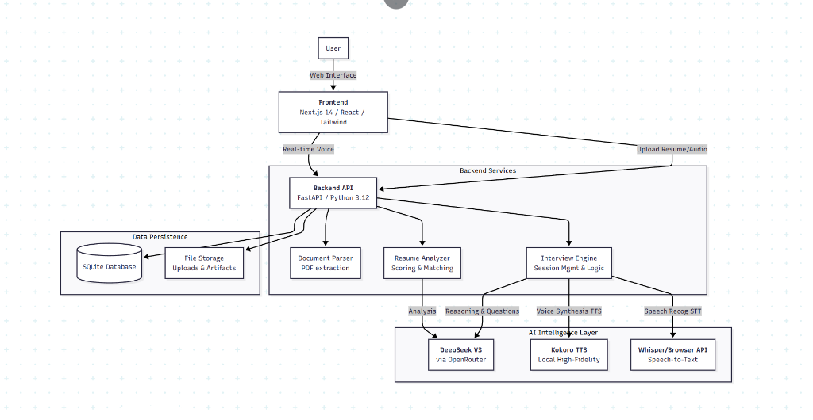

# AI-Powered Resume Analyzer & Interview Prep Platform

A comprehensive, private, and intelligent platform to supercharge your job search. analyze resumes, match with job descriptions, and practice with a hyper-realistic AI Recruiter.

## 🏗️ System Architecture

The platform follows a modern, decoupled architecture powered by state-of-the-art AI models.

## 🚀 Key Features

### 1. Resume Intelligence
*   **Deep Extraction**: Parses complex PDF/DOCX resumes.
*   **Gap Analysis**: Identifies missing keywords, career gaps, and formatting issues.
*   **ATS Scoring**: Simulates Applicant Tracking System (ATS) evaluation logic.
*   **Suggestions**: Provides actionable AI-driven improvements.

### 2. Job Matching
*   **Relevance Scoring**: Compares your resume against specific Job Descriptions (JD).
*   **Tailoring**: Suggests specific edits to align with the target role.

### 3. AI Mock Interviewer
*   **Realistic Persona**: "Sarah", a Senior Technical Recruiter, conducts the interview.
*   **Adaptive Questions**: Questions are dynamically generated by **DeepSeek V3** based on *your* resume and answering patterns.
*   **Human-Like Voice**: Powered by **Kokoro TTS** (running locally) for near-human emotional prosody and pauses.
*   **Smart Listening**: Features intelligent silence detection—the AI waits for you to finish your thought before responding.
*   **Detailed Feedback**: Receive granular scoring on Technical Knowledge, Communication, and Behavioral fit after each session.

## 🛠️ Technology Stack

*   **Frontend**: Next.js 14, TypeScript, TailwindCSS, Framer Motion
*   **Backend**: FastAPI, Pydantic, Uvicorn
*   **AI Models**:
    *   **LLM**: DeepSeek-V3 / GPT-4o
    *   **TTS**: Kokoro (Local), Edge TTS, ElevenLabs
*   **Database**: SQLite

## 🔒 Privacy & Local Execution
This platform prioritizes privacy.
*   **Local Processing**: Resume parsing and database storage happen locally.
*   **Local Voice**: Voice synthesis (Kokoro) runs entirely on your machine (optional).
*   **Private Keys**: API keys are stored securely in your local environment variables.

## 🔐 Demo Credentials

To try the platform, use these test accounts:

| Role | Email | Password |
|------|-------|----------|
| **Candidate** | `user@example.com` | `user123` |
| **Recruiter** | `recruiter@example.com` | `recruiter123` |

## 📦 Service Flow

1.  **Upload**: User uploads resume -> Backend parses text -> LLM analyzes structure.
2.  **Prep**: User pastes a Job Description -> System calculates Fit Score.
3.  **Interview**:
    *   System initiates "Interview Mode".
    *   User speaks -> Speech converted to text.
    *   DeepSeek V3 evaluates response & generates tailored follow-up.
    *   Kokoro TTS speaks the response back to user.
