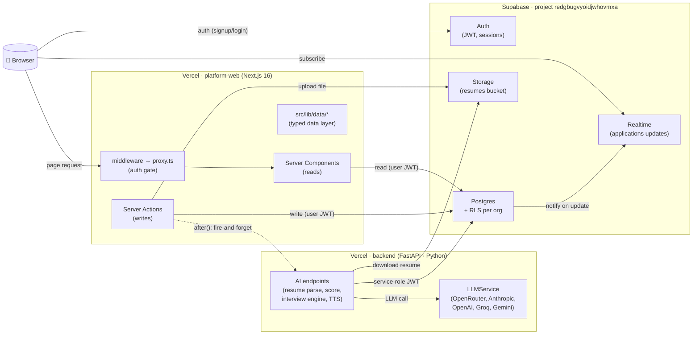
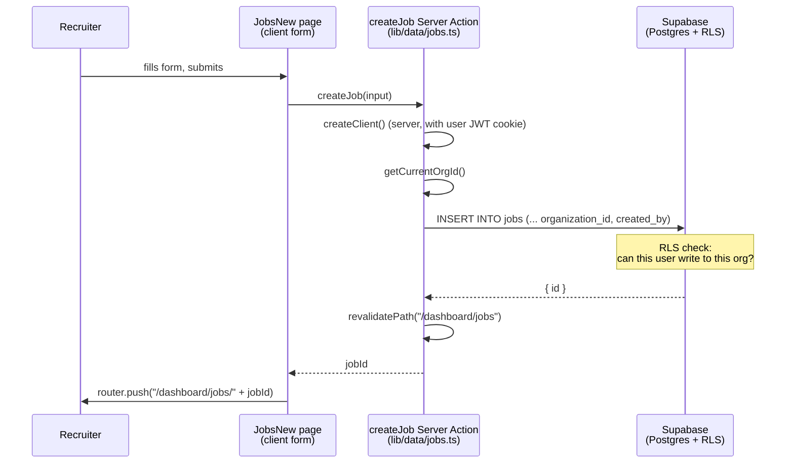
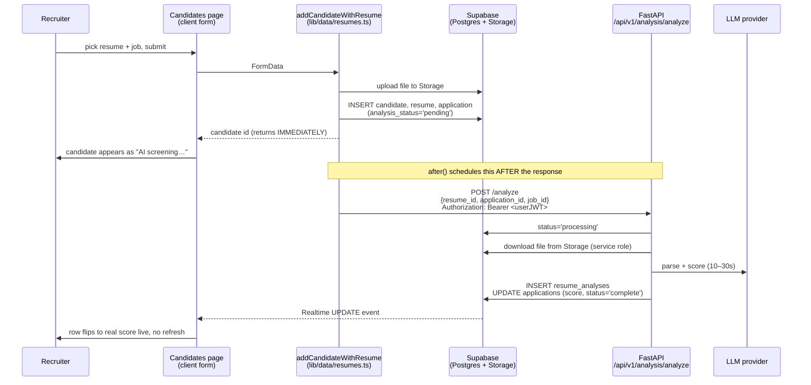

# 00 — Architecture Overview

The 30-second mental model of how the whole platform fits together.

---

## The stack



---

## The rules (the production-grade pattern this app follows)

1. **One product language.** TypeScript everywhere. Python only inside the FastAPI backend, which is narrow: it does AI compute and nothing else.
2. **The Next.js *server layer* is the API.** Pages read via **Server Components**; mutations go through **Server Actions**. The browser never holds a privileged key and never writes to the database directly.
3. **All DB access goes through one typed data layer** in `platform-web/src/lib/data/*.ts`. One module per entity (`organizations.ts`, `jobs.ts`, `candidates.ts`, etc.). Pages never call the Supabase client directly.
4. **Supabase Auth + RLS** is the multi-tenant safety net. Every org-scoped row is filtered by `organization_members` membership at the database — a bug in app code cannot leak cross-org data.
5. **AI never blocks the UI.** Server Actions schedule LLM work with Next.js `after()`; the UI shows a "screening…" state and updates live via Supabase Realtime when the score lands.
6. **Migrations as files.** Schema lives in `supabase/migrations/00*.sql`. They are idempotent and the source of truth — never edit Supabase tables directly without a migration to match.

---

## Directory map (only the parts that matter)

```
ReCruItAI/
├─ platform-web/                       # Next.js 16 frontend (THE app)
│  ├─ src/app/(dashboard)/             # recruiter workspace (auth required)
│  ├─ src/app/(auth)/                  # login, signup, accept-invite
│  ├─ src/app/(portal)/                # candidate-facing portal (no auth required)
│  ├─ src/app/interview/[id]/          # the live AI interview page
│  ├─ src/lib/supabase/                # @supabase/ssr server + browser clients
│  ├─ src/lib/data/                    # the typed data layer (every DB call lives here)
│  ├─ src/lib/ai.ts                    # the one function that calls FastAPI
│  ├─ src/lib/types/database.ts        # generated from the live Supabase schema
│  ├─ src/components/                  # Warm + Sage component library
│  └─ proxy.ts                         # Next.js 16 proxy (auth gate)
├─ backend/                            # FastAPI — AI only
│  ├─ app/auth/supabase.py             # verifies Supabase JWT
│  ├─ app/supabase_admin.py            # service-role client (writes analyses)
│  ├─ app/api/v1/endpoints/            # analysis, resume, interview, tts
│  └─ app/services/                    # LLM, parsers, analyzers
├─ supabase/migrations/                # schema (001–006). Source of truth.
└─ docs/
   ├─ superpowers/specs/               # design specs
   ├─ superpowers/plans/               # implementation plans
   ├─ superpowers/deploys/             # deploy handoffs
   └─ features/                        # ← you are here
```

---

## A typical write flow (the canonical example)

What happens when a recruiter clicks "Create Job":



Every write in the app follows this exact shape. If you can read this diagram, you can find your way through any feature in the codebase.

---

## The async-AI flow (the second canonical example)

What happens when a recruiter uploads a resume — the UI never blocks on the LLM:



This pattern (instant write + `after()` + Realtime update) is how every long-running AI feature should be built going forward.
