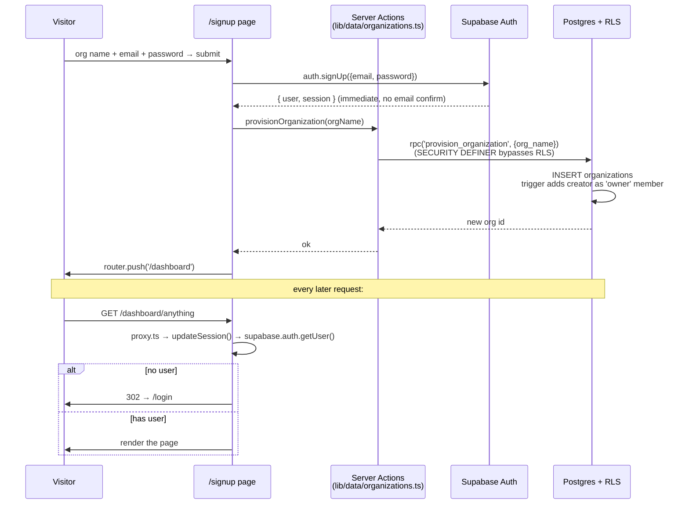

# 01 — Authentication & Organisation

**Status:** ✅ **Working**

A real, multi-tenant signup/login system. A new sign-up creates a private organisation; every recruiter in that org sees only their own data (enforced by Postgres RLS).

---

## What it does

- **Sign up** → creates a Supabase Auth user → creates an `organizations` row → makes the signup user that org's **owner**.
- **Log in** → standard email/password → sets a session cookie via `@supabase/ssr` → `/dashboard` becomes accessible.
- **Sign out** → clears the session, sends you back to `/login`.
- **Invite a teammate** → Settings → Team → enter email + role → generates an `/accept-invite?token=…` link. Teammate signs up via the link and joins the same org.
- **Protected routes** — anything under `/dashboard/*` requires a session. The Next.js 16 **proxy** (`platform-web/proxy.ts`) checks it on every request and redirects unauthenticated users to `/login`.
- **Multi-tenant isolation** — every org-scoped table has a Row Level Security policy that filters by `organization_members.user_id = auth.uid()`. Org A literally cannot SELECT org B's rows even if a bug tried.

---

## Flow

---

## Files

- **Pages:** [`(auth)/login/page.tsx`](../../platform-web/src/app/(auth)/login/page.tsx), [`(auth)/signup/page.tsx`](../../platform-web/src/app/(auth)/signup/page.tsx), [`(auth)/accept-invite/page.tsx`](../../platform-web/src/app/(auth)/accept-invite/page.tsx)
- **Sign-out Server Action:** [`(dashboard)/actions.ts`](../../platform-web/src/app/(dashboard)/actions.ts)
- **Org/invite data layer:** [`src/lib/data/organizations.ts`](../../platform-web/src/lib/data/organizations.ts)
- **Supabase clients:** [`src/lib/supabase/server.ts`](../../platform-web/src/lib/supabase/server.ts), [`client.ts`](../../platform-web/src/lib/supabase/client.ts), [`proxy.ts`](../../platform-web/src/lib/supabase/proxy.ts)
- **Auth gate:** [`platform-web/proxy.ts`](../../platform-web/proxy.ts) (the Next.js 16 root proxy)
- **DB:** [`001_foundation_schema.sql`](../../supabase/migrations/001_foundation_schema.sql) (tables + owner trigger), [`002_rls_policies.sql`](../../supabase/migrations/002_rls_policies.sql) (the RLS rules), [`004_signup_provisioning.sql`](../../supabase/migrations/004_signup_provisioning.sql) (the SECURITY DEFINER `provision_organization` and `accept_invitation` RPCs)

---

## What works

- Real signup + login against Supabase Auth.
- The proxy correctly bounces unauthenticated users away from `/dashboard/*` and signed-in users away from `/login`/`/signup`.
- Org auto-provisioning on first signup (the SECURITY DEFINER function bypasses the chicken-and-egg with RLS).
- Invite token generation + acceptance flow (token → joins existing org).
- Multi-tenant RLS is on for every org-scoped table — a quick `select count(*) from jobs` from org A's session returns only org A's rows.

## Known gaps

- **Email confirmation** must be turned **off** in the Supabase dashboard (Auth → Email → Confirm Email = OFF). With it on, the user lands on `/dashboard` with no session and bounces back to `/login`. (Phase 0 deploy handoff calls this out.)
- **Password reset / OAuth / MFA** — not yet wired. Supabase Auth supports them natively; they just need their own pages.
- **Org switcher** — Phase 0 assumes one org per user. A user can technically belong to multiple orgs (the schema supports it) but the UI picks the first.
- **Settings → Team** has a minimal invite + member-list; no role-editing UI, no member removal. RLS still enforces role-based permissions at the DB.

## Next concrete fix

If/when a teammate needs to be removed: add a `removeMember(userId)` Server Action in `organizations.ts` and a delete button on the Team Members tab. Five lines on each side. The RLS policy `members_owner_admin_write` already restricts who can do it.
