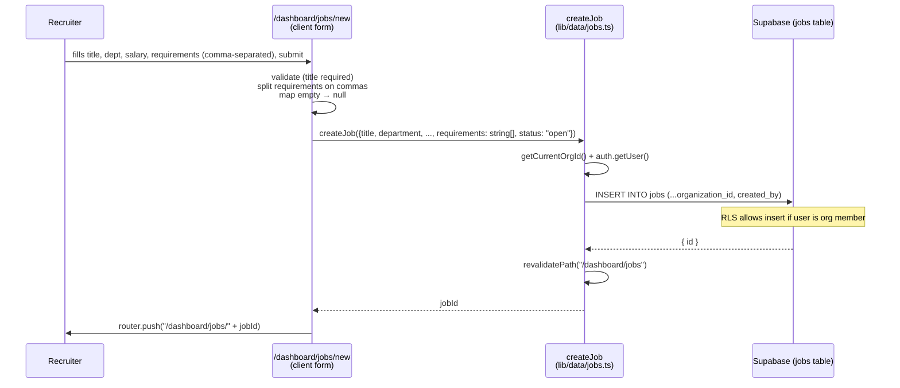
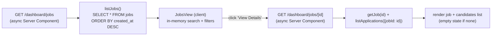

# 02 — Jobs

**Status:** ✅ **Working**

Create a job, see it in the list, open its detail page. All persistent in Supabase, all org-scoped.

---

## What it does

- **List** every job belonging to your org, newest first, with status badges and salary.
- **Create** a new job via a guided form (title, department, location, type, salary range, description, comma-separated requirements).
- **Open** a job's detail page to see its info and (after Pipeline lands) the candidates that applied.
- **Close** a job (sets `status = 'closed'`).

---

## Flow — creating a job

---

## Flow — listing & opening a job

---

## Files

- **Pages:** [`dashboard/jobs/page.tsx`](../../platform-web/src/app/(dashboard)/dashboard/jobs/page.tsx) (list — server), [`JobsView.tsx`](../../platform-web/src/app/(dashboard)/dashboard/jobs/JobsView.tsx) (client interactivity), [`jobs/new/page.tsx`](../../platform-web/src/app/(dashboard)/dashboard/jobs/new/page.tsx), [`jobs/[id]/page.tsx`](../../platform-web/src/app/(dashboard)/dashboard/jobs/[id]/page.tsx)
- **Data layer:** [`src/lib/data/jobs.ts`](../../platform-web/src/lib/data/jobs.ts) — `listJobs`, `getJob`, `createJob`, `updateJob`, `closeJob`
- **Schema:** [`001_foundation_schema.sql`](../../supabase/migrations/001_foundation_schema.sql) — `jobs` table

---

## What works

- Create, list, detail — all backed by real Postgres rows.
- Multi-platform "publish to" controls on the New Job page **render and store rows in `job_publications`** — but they do not actually post to LinkedIn/Indeed/etc. (cosmetic only). See [08 — Multi-platform Job Posting](08-multi-platform-posting.md).
- The Job Detail page shows the real list of candidates that applied to this job (linked through `applications.job_id`).

## Known gaps

- **Editing a job from the UI:** `updateJob` exists in the data layer, but there's no inline edit form on the detail page yet.
- **Job status filters in the list:** the basic search works, but tabs like Active / Closed / Draft aren't wired (the data has the field; the UI just doesn't show the tabs).
- **Multi-platform publishing is cosmetic** (doc 08).

## Next concrete fix

Add a quick "Edit" pencil button on the Job Detail page that opens a small drawer with the existing `Field` components and submits via `updateJob`. ~30 lines.
