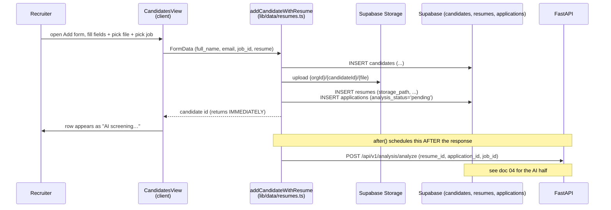
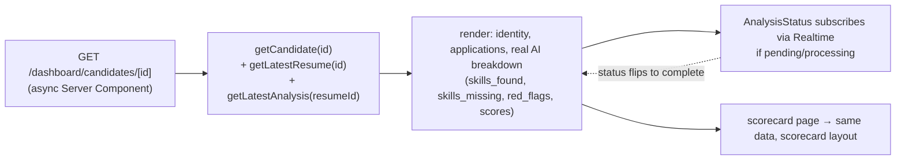

# 03 — Candidates

**Status:** ✅ **Working** (with the AI-screening sub-flow being ⚠️ Partial — needs the deployed backend; see doc 04)

Add candidates with resumes, see them in a sortable list, open their detail page with the real AI analysis breakdown.

---

## What it does

- **List** all candidates in your org with the application's stage, AI-fit badge, and source.
- **Add a candidate** via an inline form: name, email, optional phone/role/company, pick a job, upload a resume file.
- **Open** a candidate's detail page to see identity, all applications (across jobs), and the latest AI analysis (skills matched, skills missing, red flags, breakdown).
- **Re-run screening** on a candidate whose `analysis_status` is `pending` or `failed`.
- A live `<AnalysisStatus>` badge updates without a refresh when the AI score lands (Supabase Realtime).

---

## Flow — adding a candidate + resume

## Flow — opening a candidate

---

## Files

- **Pages:** [`candidates/page.tsx`](../../platform-web/src/app/(dashboard)/dashboard/candidates/page.tsx) (list, server), [`CandidatesView.tsx`](../../platform-web/src/app/(dashboard)/dashboard/candidates/CandidatesView.tsx) (client + Add form), [`candidates/[id]/page.tsx`](../../platform-web/src/app/(dashboard)/dashboard/candidates/[id]/page.tsx), [`candidates/[id]/scorecard/page.tsx`](../../platform-web/src/app/(dashboard)/dashboard/candidates/[id]/scorecard/page.tsx)
- **Data layer:** [`src/lib/data/candidates.ts`](../../platform-web/src/lib/data/candidates.ts) — `listCandidates`, `getCandidate`, `getLatestResume`, `getLatestAnalysis`, `createCandidate`. [`src/lib/data/resumes.ts`](../../platform-web/src/lib/data/resumes.ts) — `addCandidateWithResume`, `rerunAnalysis`.
- **Live badge:** [`src/components/AnalysisStatus.tsx`](../../platform-web/src/components/AnalysisStatus.tsx) — subscribes to `applications` Realtime updates.
- **Schema:** [`001_foundation_schema.sql`](../../supabase/migrations/001_foundation_schema.sql) (`candidates`, `resumes`, `applications`), [`005_async_analysis.sql`](../../supabase/migrations/005_async_analysis.sql) (`analysis_status` enum + Realtime publication).

---

## What works

- Add candidate → resume uploaded to Supabase Storage → rows inserted → "AI screening…" appears immediately, persistent.
- Candidate Detail shows the real LLM-produced breakdown (when the backend ran the analysis).
- Re-run screening re-fires the analysis for a stuck/failed application.
- Live status update via Realtime — no page refresh needed.

## Known gaps

- **AI screening requires the deployed backend** — without it, status stays `pending`. See [doc 04](04-resume-ai-screening.md).
- **Editing candidate fields** — the detail page is read-only.
- **Bulk import** (CSV / drag-and-drop multiple resumes) — not yet.

## Next concrete fix

Make `current_role`, `current_company`, `phone` editable on the Candidate Detail page (Server Action calling a small `updateCandidate` in `candidates.ts`). The data is already there; the UI just lacks an edit affordance.
