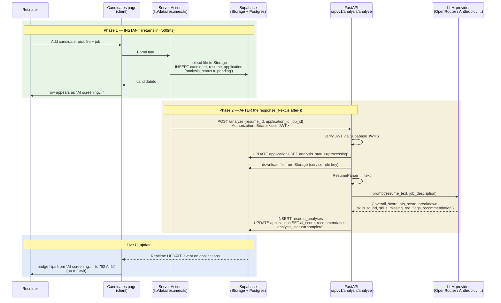

# 04 — Resume AI Screening (async)

**Status:** ⚠️ **Partial** — the code is real end-to-end; today it works only when the FastAPI backend is reachable. The frontend never blocks on it.

The recruiter uploads a resume. The candidate appears **instantly** as "AI screening…". An LLM scores the resume against the job in the background. The score appears live on the page without a refresh, via Supabase Realtime.

This is the canonical async-AI pattern in the app — copy it for any future LLM feature.

---

## The two-phase flow

**Failure mode** — if FastAPI errors at any step, it sets `analysis_status='failed'` + `analysis_error='...'` and returns HTTP 200 `{ok:false}`. The row is visible; the recruiter clicks **Re-run screening** to retry. The frontend never errors.

---

## Why async?

A real LLM resume score takes 10–30 seconds. If the Server Action awaited it, the recruiter's upload form would hang for half a minute and the page would appear broken. With `after()`:

- Upload returns in <500ms.
- The candidate row appears immediately.
- The score fills in live when ready.
- Even if the recruiter closes the tab, the FastAPI request keeps running on the server.

---

## Files

### Frontend
- [`src/lib/data/resumes.ts`](../../platform-web/src/lib/data/resumes.ts) — `addCandidateWithResume` (the orchestrator), `rerunAnalysis`
- [`src/lib/ai.ts`](../../platform-web/src/lib/ai.ts) — `triggerAnalysis()` — the only fetch to FastAPI
- [`src/components/AnalysisStatus.tsx`](../../platform-web/src/components/AnalysisStatus.tsx) — Realtime subscriber that flips the badge live

### Backend
- [`backend/app/api/v1/endpoints/analysis.py`](../../backend/app/api/v1/endpoints/analysis.py) — the `/analyze` endpoint
- [`backend/app/services/analysis_persistence.py`](../../backend/app/services/analysis_persistence.py) — pure `build_analysis_row()` mapping (TDD-covered)
- [`backend/app/services/resume/`](../../backend/app/services/resume/) — parser + analyzer
- [`backend/app/services/llm/`](../../backend/app/services/llm/) — provider abstraction (OpenRouter, Anthropic, Groq, OpenAI, Gemini)
- [`backend/app/auth/supabase.py`](../../backend/app/auth/supabase.py) — JWKS verification dependency
- [`backend/app/supabase_admin.py`](../../backend/app/supabase_admin.py) — service-role client

### DB
- [`005_async_analysis.sql`](../../supabase/migrations/005_async_analysis.sql) — `analysis_status` enum + column on `applications`, plus enabling Realtime on that table

---

## What works

- Frontend → Storage → DB rows → `after()` → FastAPI request — all real.
- FastAPI verifies the Supabase JWT (rejects unauthenticated requests).
- FastAPI persists `resume_analyses` and updates `applications` — verified by `tests/test_analysis_persist.py`.
- Realtime subscription on `applications` is live (migration 005 adds it to the `supabase_realtime` publication).

## Known gaps

- **The FastAPI backend isn't deployed yet.** Until it is, `analysis_status` stays `pending` forever and no score lands. The frontend Server Action's `after()` call goes to `NEXT_PUBLIC_API_URL` which is currently a placeholder. See the [deploy handoff](../superpowers/deploys/2026-05-22-phase-0-deploy-handoff.md) §2.
- **No retry loop.** A failed analysis is shown as "Screening failed"; the recruiter has to click Re-run. No automatic backoff.
- **No model choice / cost cap surfaced.** The LLM provider/model is determined by the backend's env. A future Settings → AI screen could expose this.

## Next concrete fix

**Deploy the FastAPI backend** (deploy handoff §2). Setting `SUPABASE_SERVICE_ROLE_KEY` + `SUPABASE_JWKS_URL` + at least one LLM provider key in the backend Vercel project, then updating the frontend's `NEXT_PUBLIC_API_URL` to the backend URL, lights this entire path up end-to-end.
