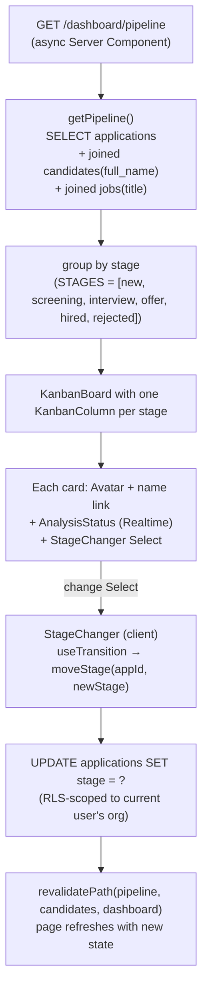

# 05 — Pipeline (Kanban)

**Status:** ✅ **Working** (stage moves persist immediately) · 🚧 Drag-and-drop is Phase 1, not Phase 0

A six-column Kanban board grouping every application in the org by stage. Each card shows the candidate, the role, and a live AI-screening badge.

---

## What it does

- One column per `applications.stage` value: **new · screening · interview · offer · hired · rejected**.
- Each card: avatar + candidate name + job title + `<AnalysisStatus>` (live AI badge) + a stage-change **Select**.
- Changing a card's stage via the Select **persists immediately** (no drag-drop yet, but the underlying move is real and Realtime-aware).
- Cards link through to the candidate's detail page.

---

## Flow

---

## Files

- **Page:** [`dashboard/pipeline/page.tsx`](../../platform-web/src/app/(dashboard)/dashboard/pipeline/page.tsx)
- **Stage-change control:** [`src/components/StageChanger.tsx`](../../platform-web/src/components/StageChanger.tsx)
- **Data layer:** [`src/lib/data/applications.ts`](../../platform-web/src/lib/data/applications.ts) (`getPipeline`, `moveStage`)
- **Stage type/constants (split out so `"use server"` modules don't violate the async-only rule):** [`src/lib/data/application-types.ts`](../../platform-web/src/lib/data/application-types.ts)
- **Kanban primitives:** [`src/components/Kanban.tsx`](../../platform-web/src/components/Kanban.tsx)

---

## What works

- All six columns render real applications, grouped from the DB.
- The stage-change Select persists immediately; another open browser tab on the same page sees the change live (Realtime + revalidate).
- Cards linking to `/dashboard/candidates/[id]` works end-to-end.
- The board scrolls horizontally cleanly on narrow viewports.

## Known gaps

- **No drag-and-drop yet** — Phase 0 ships a Select-based stage change; drag-drop is on the Phase 1 backlog (the spec calls this out explicitly).
- **No per-job swimlanes / per-job filter on the pipeline page** — it shows the whole org's pipeline. (`getPipeline()` accepts a `jobId` opt; the UI just doesn't surface a job picker yet.)
- **No move-reason capture** — moving a candidate to `rejected` should prompt for a reason and store it. Not in Phase 0.

## Next concrete fix

For drag-and-drop: install a small DnD library (`@dnd-kit/core` is the modern choice for React 19). Wrap each `KanbanColumn` in a `<Droppable>` and each `KanbanCard` in a `<Draggable>`. On drop, call the same `moveStage` Server Action that the Select already calls. Optimistic UI via `useOptimistic`. Maybe ~80 lines.
