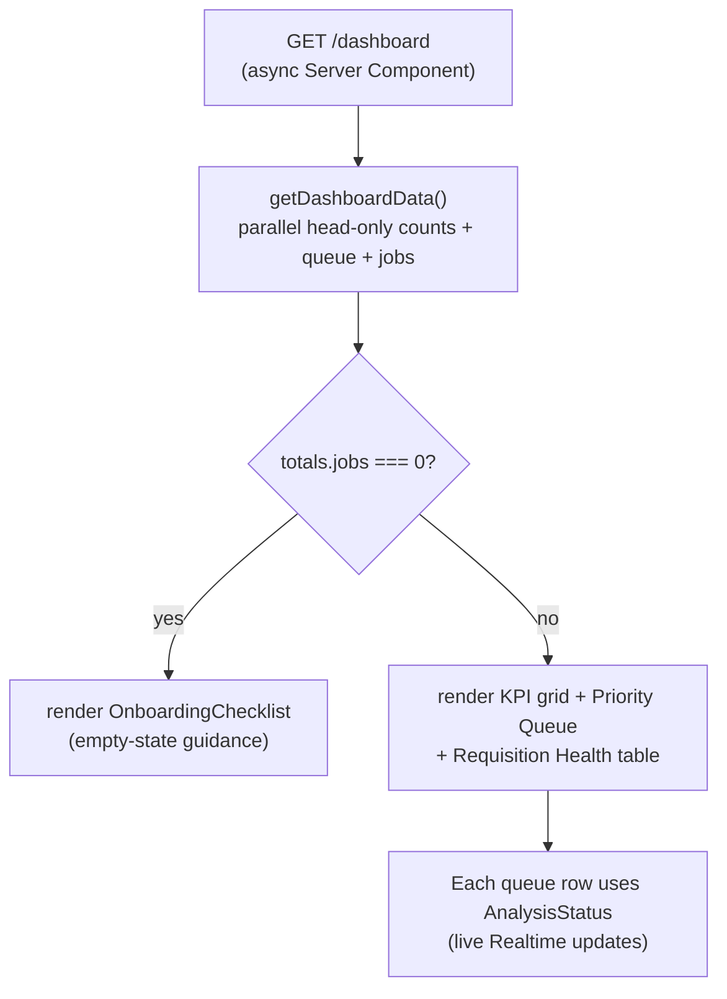

# 06 — Dashboard (KPIs + Onboarding)

**Status:** ✅ **Working**

The recruiter's morning landing page. Shows real KPIs over the org's data, a priority queue, the requisition health table, and — for a brand-new org — an onboarding checklist with a one-click "Load sample data".

---

## What it shows

- **Four KPI cards** (head-only count queries — fast):
  - **Needs Review** — `applications` where stage = `new`
  - **SLA Risks** — `applications` where `analysis_status = 'failed'`
  - **Interviews Pending** — `applications` where stage = `interview`
  - **Offers Pending** — `applications` where stage = `offer`
- **Today's Priority Queue** — top 5 applications by `ai_score` (excluding rejected/hired), with a live `<AnalysisStatus>` per row.
- **Active Requisition Health** — top 5 open jobs with applicant counts.
- **Onboarding Checklist** (rendered instead of the queue when the org has zero jobs):
  1. Post your first job
  2. Add your first candidate
  3. Invite a teammate
  4. Load sample data (one-click seed; see [09 — Sample Data](09-sample-data.md))

---

## Flow

---

## Files

- **Page:** [`dashboard/page.tsx`](../../platform-web/src/app/(dashboard)/dashboard/page.tsx)
- **Data layer:** [`src/lib/data/dashboard.ts`](../../platform-web/src/lib/data/dashboard.ts) — `getDashboardData()`
- **Onboarding checklist:** [`src/components/OnboardingChecklist.tsx`](../../platform-web/src/components/OnboardingChecklist.tsx)

---

## What works

- All four KPIs are real `select count(*)` queries scoped to the user's org via RLS.
- Priority queue and active-jobs use single aggregate queries — no N+1.
- Onboarding checklist correctly ticks items based on real data.
- "Load sample data" / "Clear sample data" buttons are wired to the seed Server Actions.

## Known gaps

- **SLA-risk metric currently means "failed AI analysis"** (the simplest signal we have). A richer "SLA" definition (e.g. days-in-stage > threshold) is later phase.
- **No date-range picker** on the KPIs.
- **No "what changed since you last logged in" digest** — a planned P1 feature.

## Next concrete fix

Add a `days_in_stage` derived field (computed from `applications.updated_at`) and let the SLA Risks card filter on `stage IN (new, screening) AND days_in_stage > 7`. ~10 lines in `dashboard.ts`.
