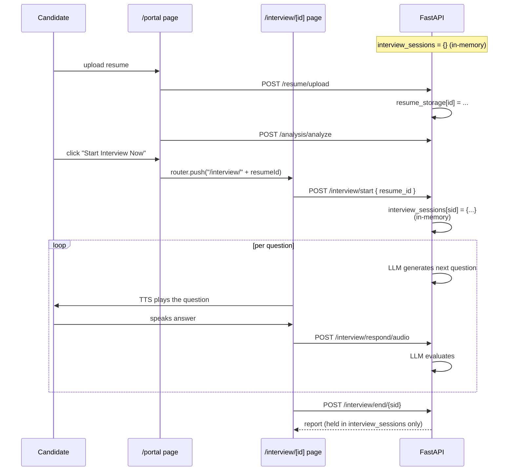

# 07 — AI Live Interview

**Status:** ⚠️ **Partial** — the interview *engine* is real; persistence and the recruiter→candidate invite flow are not. **Today a real external candidate cannot do an interview via a recruiter-sent link.**

---

## What's real

- The candidate-facing page at `/interview/[id]` is fully wired. It calls real backend endpoints:
  - `POST /api/v1/interview/start`
  - `POST /api/v1/interview/respond` (text) / `POST /api/v1/interview/respond/audio` (voice blob)
  - `POST /api/v1/interview/end/{session_id}`
  - `POST /api/v1/tts/synthesize` (with browser `SpeechSynthesis` as a fallback)
- The FastAPI `InterviewEngine` makes real LLM calls (OpenRouter / Anthropic / OpenAI / Groq / Gemini) for: intro message, per-question generation, response evaluation, follow-up generation, closing message.
- Voice recording, silence detection, transcript building — all functional.
- The candidate **self-service path works locally**: `/portal` → upload resume → analyse → "Start Interview Now" → the interview begins. As long as the backend is up, the whole flow runs.

## What's broken / missing

- **Persistence is in-memory only.** `backend/app/api/v1/endpoints/interview.py` defines `interview_sessions = {}` — a plain Python dict in process memory. The Supabase tables `interview_sessions` and `interview_reports` (created in migration 001) exist but **no code writes to them**. A backend restart wipes every session and every report.
- **Recruiter "Copy link" generates a broken URL.** On `/dashboard/interviews`, the button does `clipboard.writeText("/interview/" + candidate.id)` — but `candidate.id` is a mock-data id. When opened, the backend's `/start` endpoint looks up `resume_storage[id]` and 404s, because no upload with that id exists.
- **"Send interview invite" is a hardcoded demo.** The route `platform-web/src/app/api/v1/recruiter/candidates/[id]/interview-invite/route.ts` returns a string `"Demo invite queued for ..."`. No email is sent.
- **No auth on `/interview/[id]`.** The interview page has zero session check (intentionally — candidates aren't recruiters). But there's also no signed-token verification — anyone can guess a URL.

## The result for the user

| Path | Works? |
|---|---|
| Local demo: `/portal` upload → analyse → Start Interview, backend stays alive | ✅ Yes |
| Recruiter clicks "Copy link" → sends URL to a real candidate → candidate clicks | ❌ No — backend 404s |
| Candidate finishes interview → recruiter restarts backend → opens scorecard | ❌ Session lost |
| Candidate finishes interview → recruiter views report immediately (same instance) | ✅ Yes (in-memory) |

---

## Current flow (today — limited)



Anything after the backend process restarts: gone.

---

## Files

### Frontend
- [`platform-web/src/app/interview/[id]/page.tsx`](../../platform-web/src/app/interview/[id]/page.tsx) — the live page
- [`(portal)/portal/page.tsx`](../../platform-web/src/app/(portal)/portal/page.tsx) — the only working entry point today
- [`(dashboard)/dashboard/interviews/page.tsx`](../../platform-web/src/app/(dashboard)/dashboard/interviews/page.tsx) — recruiter view; mostly preview (uses mock data + the broken Copy link)
- `src/app/api/v1/recruiter/candidates/[id]/interview-invite/route.ts` — fake stub

### Backend
- [`backend/app/api/v1/endpoints/interview.py`](../../backend/app/api/v1/endpoints/interview.py) — has the in-memory dict
- [`backend/app/api/v1/endpoints/report.py`](../../backend/app/api/v1/endpoints/report.py) — also reads from the in-memory dict
- [`backend/app/services/interview/`](../../backend/app/services/interview/) — `engine.py`, `advanced_engine.py` (the real LLM logic)
- [`backend/app/services/tts/`](../../backend/app/services/tts/) — `service.py` (real ElevenLabs / browser fallback)

### DB
- [`001_foundation_schema.sql`](../../supabase/migrations/001_foundation_schema.sql) — `interview_sessions` and `interview_reports` tables are defined but **no code touches them**.

---

## The fix — the smallest concrete PR that unblocks the candidate flow

Three changes, each independently shippable:

### Step 1 — Persist sessions to Supabase (un-block the report and restart-survival)

Replace the in-memory dict with the existing `interview_sessions` table. The schema is already there.

```python
# backend/app/api/v1/endpoints/interview.py — sketch
from app.supabase_admin import admin_client

@router.post("/start")
async def start_interview(body: StartReq, claims = Depends(verify_supabase_jwt)):
    db = admin_client()
    # Look up the resume (already persistent after Phase 0 doc 04)
    resume = db.table("resumes").select("*").eq("id", body.resume_id).single().execute().data
    # Create the session row instead of a dict entry
    session = db.table("interview_sessions").insert({
        "organization_id": resume["organization_id"],
        "candidate_id": resume["candidate_id"],
        "job_id": body.job_id,
        "status": "in_progress",
        "transcript": [],
        "scores": {},
        "started_at": "now()",
    }).select("*").single().execute().data
    return { "session_id": session["id"], ... }

@router.post("/respond")
async def respond(body: RespondReq, claims = Depends(verify_supabase_jwt)):
    db = admin_client()
    sess = db.table("interview_sessions").select("*").eq("id", body.session_id).single().execute().data
    # ... run the LLM evaluation, append to transcript ...
    db.table("interview_sessions").update({
        "transcript": new_transcript,
        "scores": new_scores,
    }).eq("id", body.session_id).execute()

@router.post("/end/{sid}")
async def end_interview(sid: str, claims = Depends(verify_supabase_jwt)):
    db = admin_client()
    # ... finalize ...
    db.table("interview_sessions").update({"status": "completed", "ended_at": "now()"}).eq("id", sid).execute()
    # Build the report and store it
    db.table("interview_reports").insert({
        "session_id": sid, "summary": ..., "scorecard": ..., "recommendation": ...,
    }).execute()
```

That's it — the schema already has every column. Restart-survival, recruiter review, and a real `interview_reports` row are all unlocked.

### Step 2 — Real recruiter invite (a signed link, not a clipboard hack)

Replace the `interview-invite` stub with a small Server Action:

```ts
// platform-web/src/lib/data/interviews.ts (new)
"use server";
export async function createInterviewInvite(applicationId: string) {
  const supabase = await createClient();
  // 1. Find the application + its resume_id
  const app = await supabase.from("applications").select("...").eq("id", applicationId).single();
  // 2. Insert a row (e.g. extend the interview_sessions table or add an `interview_invites` table)
  //    with a long unguessable `token`
  // 3. Build the URL: `${origin}/interview/${token}`
  // 4. Optionally: send the email (Resend / Supabase Auth email / nodemailer)
  return inviteUrl;
}
```

On the Interviews page, the "Copy link" button calls this action instead of using mock candidate ids.

### Step 3 — Token-gated access on `/interview/[id]`

The page already takes the `id` from the URL. Change its semantic: `id` is now the invite *token* (not a resume id). The page's first call becomes:

```ts
// look up the token → get session_id + resume_id, then begin
const session = await fetch(`${API}/interview/by-token/${token}`)
```

This makes the link unguessable and tied to one candidate.

---

After those three steps the recruiter can hire-screen a real external candidate end-to-end without them ever needing an account: a token-link drops them into the AI interview, the session and report are persistent, and the recruiter sees the report on the candidate's detail page.
