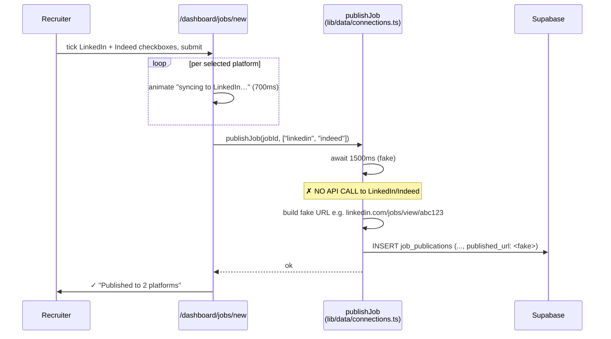
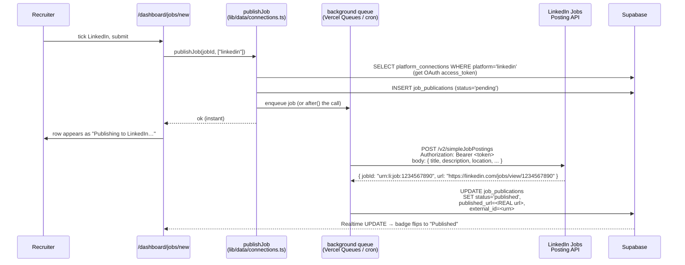

# 08 — Multi-platform Job Posting

**Status:** ❌ **Cosmetic only — no real job-board integrations exist.** The UI and the database tables are real; what's missing is every integration layer between Supabase and the actual job boards.

This is the gap you specifically flagged: *"can't see options to post job to multiple platforms from a single platform."* The options *are* visible — they just don't post.

---

## What exists today

- **UI in two places:**
  - `/dashboard/sourcing` — a status board listing LinkedIn, Indeed, Glassdoor, Naukri with "Connected" badges. **No publish button on this page** — it's display only with a "Configure Integrations" link to Settings.
  - `/dashboard/jobs/new` — the New Job form has a "Publish to" multi-select pulling from the connected platforms. On submit it animates a per-platform "syncing…" progress bar.
- **Two real Supabase tables (migration 006 — applied via SQL editor):**
  - `platform_connections (id, organization_id, platform, status, settings, created_at)` — which boards an org has "connected".
  - `job_publications (id, job_id, platform, status, published_url, created_at)` — which jobs were "published" to which board.
- **A working data layer:** `lib/data/connections.ts` reads/writes both tables, with an **in-memory fallback** for when the migration hasn't been applied yet (gracefully degrades).
- **A `publishJob()` Server Action** that fires when the user clicks Publish.

## What's missing — and this is everything that matters

- **Zero HTTP calls to any job board.** No code anywhere in the repo calls LinkedIn, Indeed, Naukri, Glassdoor, Greenhouse, or any ATS API. The backend's only external HTTP is to LLM providers.
- **The `published_url` stored in `job_publications` is fabricated.** Inside `publishJob()`, after a 1500ms artificial delay, the code builds strings like `https://www.linkedin.com/jobs/view/codesstellar-abc123` and inserts that as the `published_url`. LinkedIn never sees the job.
- **The `platform_connections.settings` JSON has no OAuth tokens / API keys.** Today it stores a fake `username` field and nothing more. There is no place to authenticate to a real API.
- **No webhook / status sync.** Even if a job were posted, there's no listener for "this job was viewed N times" or "this candidate applied through LinkedIn".

So today, a recruiter clicking "Publish" gets a satisfying-looking animation, an entry appears in their dashboard, and **nothing leaves the platform**.

---

## Today's (cosmetic) flow



---

## The real flow (target — what it should be)



---

## Files

- **Sourcing page:** [`dashboard/sourcing/page.tsx`](../../platform-web/src/app/(dashboard)/dashboard/sourcing/page.tsx)
- **Publish UI:** [`dashboard/jobs/new/page.tsx`](../../platform-web/src/app/(dashboard)/dashboard/jobs/new/page.tsx)
- **Data layer:** [`src/lib/data/connections.ts`](../../platform-web/src/lib/data/connections.ts) — `listConnections`, `addConnection`, `removeConnection`, `publishJob`, `listPublicationsForJob`
- **Schema:** [`006_platform_connections.sql`](../../supabase/migrations/006_platform_connections.sql) — both tables + RLS

---

## The fix — pick one board to actually integrate

**Recommended first integration: LinkedIn Jobs Posting API.** It's the channel recruiters most expect and LinkedIn has a public REST API that supports job posting via OAuth 2.0.

The work, in order:

### Step 1 — Real connection (one-time OAuth per org)
1. Register an app in the LinkedIn Developer Portal; get a `client_id`/`client_secret`.
2. Add a "Connect LinkedIn" button on `/dashboard/sourcing` that opens the LinkedIn OAuth consent screen with redirect URL `https://your-app.vercel.app/api/connections/linkedin/callback`.
3. New Route Handler: `src/app/api/connections/linkedin/callback/route.ts` — exchanges the `code` for an access token, calls `addConnection({ platform: "linkedin", settings: { access_token, refresh_token, expires_at } })`.
4. Tokens are encrypted at rest? At minimum, only readable by the org owner — RLS on `platform_connections` already restricts to org members.

### Step 2 — Real publish (replace the fake URL)
Update `publishJob()` in `connections.ts`:

```ts
async function publishToLinkedIn(job, accessToken) {
  const res = await fetch("https://api.linkedin.com/v2/simpleJobPostings", {
    method: "POST",
    headers: {
      Authorization: `Bearer ${accessToken}`,
      "Content-Type": "application/json",
    },
    body: JSON.stringify({
      // shape per LinkedIn's API spec
      title: job.title,
      description: job.description,
      location: job.location,
      employmentType: job.employment_type,
      // ... etc
    }),
  });
  if (!res.ok) throw new Error(`LinkedIn API failed: ${res.status}`);
  const { jobId, url } = await res.json();
  return { external_id: jobId, published_url: url };
}

export async function publishJob(jobId: string, platforms: string[]) {
  // ... existing code: select job, find connection ...
  for (const platform of platforms) {
    if (platform === "linkedin") {
      const { external_id, published_url } = await publishToLinkedIn(job, connection.settings.access_token);
      await supabase.from("job_publications").insert({
        job_id: jobId,
        platform: "linkedin",
        status: "published",
        published_url, // ← REAL url from LinkedIn now
        external_id,
      });
    }
    // other platforms — leave the cosmetic path until each is integrated
  }
}
```

### Step 3 — Make it async + observable
- Use `after()` so the recruiter's submit returns instantly (LinkedIn API may take 2–5s).
- Insert the `job_publications` row immediately with `status='pending'`; flip to `published` or `failed` after the API call.
- Subscribe the UI to `job_publications` via Realtime (the same pattern as `applications` → `AnalysisStatus`) so the badge flips live.

### Step 4 — Add the other boards one at a time
Each follows the same shape — Indeed (XML feed or Indeed Apply API), Naukri (their partner API), etc. The data layer + UI + Supabase tables are already there. Each new board = one OAuth handler + one `publishToX()` function.

---

## Why this approach is sound

- The recruiter's UI doesn't change — they already see a Publish flow today.
- The DB schema doesn't need to change — `platform_connections.settings` is `jsonb`, so each board's auth fields just go in there.
- Each board is shippable independently — start with LinkedIn, light it up for real, then add the next one without changing any existing wiring.
- The fake `published_url`s already in the DB can be swept up later by a migration that nulls them and re-publishes.
