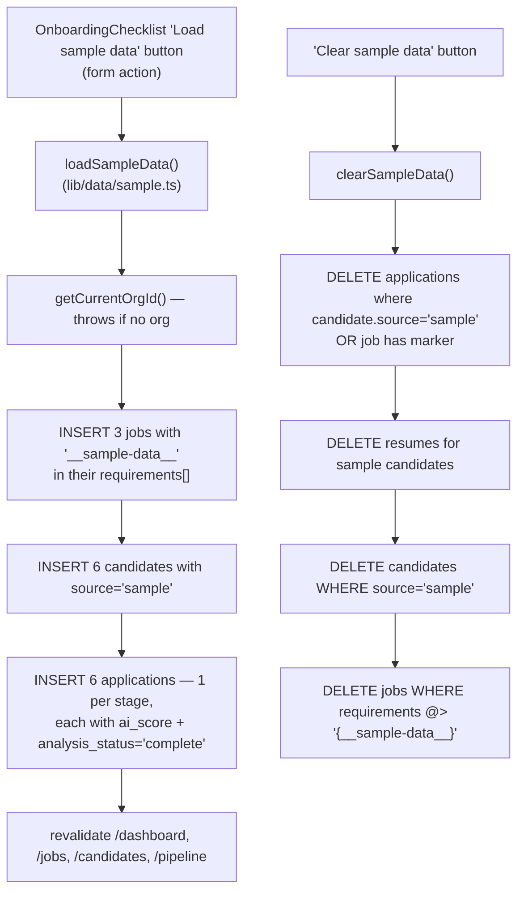

# 09 — Sample Data Seed

**Status:** ✅ **Working**

One-click "Load sample data" populates a fresh org with a realistic-looking workspace so it doesn't look empty in a demo. One-click "Clear sample data" wipes it again.

---

## What it does

- **Load sample data** inserts, for the *current* org:
  - 3 sample jobs (Senior Product Designer, Backend Engineer, Recruiter Operations Manager)
  - 6 sample candidates (`source = 'sample'`)
  - 6 applications spread across all six stages with pre-filled AI scores and `analysis_status = 'complete'` (no LLM call — illustrative scores)
- **Clear sample data** deletes only the rows it created (matched by `candidates.source = 'sample'` and by the `"__sample-data__"` marker tucked into `jobs.requirements`), in FK-safe order: applications → resumes → candidates → jobs.

Both actions are strictly org-scoped — clearing sample data in org A cannot touch org B.

---

## Flow

---

## Files

- **Data layer:** [`src/lib/data/sample.ts`](../../platform-web/src/lib/data/sample.ts) — `loadSampleData()`, `clearSampleData()`
- **Onboarding wiring:** [`src/components/OnboardingChecklist.tsx`](../../platform-web/src/components/OnboardingChecklist.tsx) — the Load/Clear buttons live here

---

## What works

- A fresh signup → Dashboard's onboarding checklist → click "Load sample data" → KPIs and Pipeline populate instantly.
- Clear-sample-data removes only the seeded rows; the recruiter's real jobs and candidates are untouched.
- Idempotent: clicking Load twice creates duplicates (safe — they don't conflict).

## Known gaps

- **No "is sample-data active" indicator** beyond the conditional Clear button. A small banner like "Showing sample data — clear it before going live" would help during a demo.
- **No real resume files** — the sample candidates have applications and scores, but `getLatestResume()` returns nothing for them (the AI breakdown won't show). The seed could optionally insert a stub `resumes` row + a tiny stored placeholder PDF.

## Next concrete fix

Add an `is_sample` boolean column to `jobs` and `candidates` in a small migration (`007_sample_marker`), so `clearSampleData` becomes a one-liner per table and the "requirements marker" hack goes away. ~20 lines.
