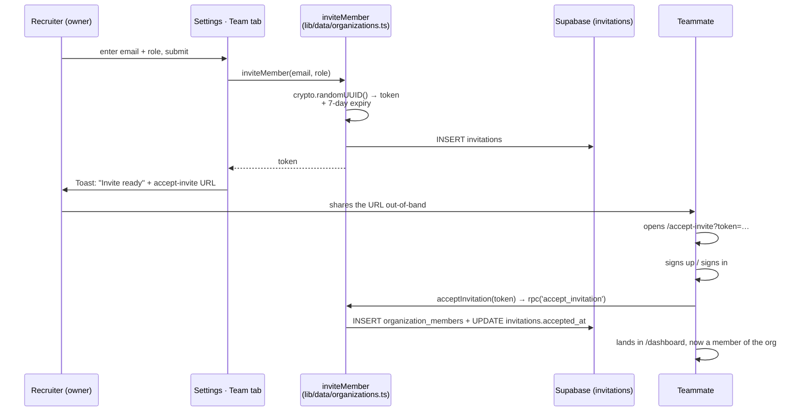

# 10 — Settings & Team Invites

**Status:** ✅ **Working** (Organization tab + Team Members tab) · 🚧 **Preview** (Enterprise controls — RBAC editor, audit logs, data retention, integrations)

The Settings page is a mixed surface. The Org and Team tabs are real; the Enterprise controls cards are a P2 preview.

---

## What's real

- **Tabs** — Organisation, Team Members, Integrations (the tab strip is a real client component with `useState`).
- **Organisation tab** — shows org info (name, slug) and a Save Changes button wired to the `useToast()` hook (currently the action is a no-op; saving more org fields is a small future change).
- **Team Members tab** — lists real members from `listMembers()`, and an invite form (email + role `Select`) wired to `inviteMember()` which inserts an `invitations` row and surfaces the generated `/accept-invite?token=...` link via a toast.

## What's preview

- **Enterprise controls** cards (RBAC, Audit logs, Data retention, Integrations) on the bottom of the Organisation tab come from `mockEnterpriseControls`. They render but don't do anything. Those are P2 features; the spec deliberately defers them.

---

## Flow — inviting a teammate

---

## Files

- **Page:** [`dashboard/settings/page.tsx`](../../platform-web/src/app/(dashboard)/dashboard/settings/page.tsx)
- **Accept-invite page:** [`(auth)/accept-invite/page.tsx`](../../platform-web/src/app/(auth)/accept-invite/page.tsx)
- **Data layer:** [`src/lib/data/organizations.ts`](../../platform-web/src/lib/data/organizations.ts) — `listMembers`, `inviteMember`, `acceptInvitation`
- **DB:** [`001_foundation_schema.sql`](../../supabase/migrations/001_foundation_schema.sql) (`invitations`), [`002_rls_policies.sql`](../../supabase/migrations/002_rls_policies.sql), [`004_signup_provisioning.sql`](../../supabase/migrations/004_signup_provisioning.sql) (the `accept_invitation` RPC)

---

## What works

- Real invite flow end-to-end (token stored, accept marks `accepted_at`, member joins).
- The Team Members tab shows real members.
- Toast surfaces the URL the recruiter can paste to the teammate.

## Known gaps

- **No email send** — the recruiter manually shares the URL. Plugging into Resend / SendGrid / Supabase Auth's built-in email is a small future change.
- **No role-editing UI / member removal UI** — the data layer doesn't have `updateMemberRole` / `removeMember` yet. RLS would still enforce permissions at the DB.
- **The Org tab's Save Changes** is a placeholder — wire it to `updateOrganization(name)` when needed.
- **Enterprise controls are preview** (RBAC editor, audit-log viewer, data retention, integrations marketplace). P2.

## Next concrete fix

Add `updateOrganization(patch)` Server Action and wire the Org tab's Save Changes button to it (with real input fields for the org name). ~15 lines.
