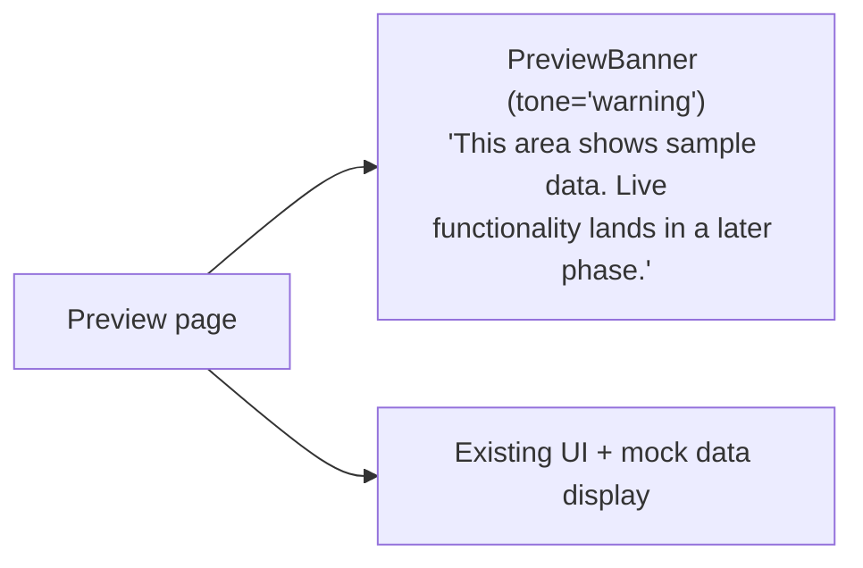

# 11 — Preview-only Pages

**Status:** 🚧 **Preview** — these pages render with mock data and have a yellow `<PreviewBanner>` at the top warning the user. Live functionality lands in later phases.

These pages are *visible* in the sidebar and *look* like they work, but they read from `mockData.ts` and their action buttons are not wired to anything. They were kept (rather than removed) so the platform feels complete during demos and so the eventual real implementations have a UI to wire into.

---

## The nine preview pages

| Sidebar entry | Path | Real version arrives in |
|---|---|---|
| Hiring Flow | `/dashboard/hiring-flow` | Phase 1 — operational center for a hiring run |
| Interviews | `/dashboard/interviews` | Phase 1 (the AI engine itself is real — see [07](07-ai-interview.md)) |
| Collaboration | `/dashboard/collaboration` | Phase 1 |
| Comms | `/dashboard/communications` | Phase 2 |
| Sourcing | `/dashboard/sourcing` | Phase 2 — depends on real multi-platform posting ([08](08-multi-platform-posting.md)) |
| Automations | `/dashboard/automations` | Phase 2 |
| Analytics | `/dashboard/analytics` | Phase 2 |
| Notifications | `/dashboard/notifications` | Phase 1 |
| Profile | `/dashboard/profile` | Phase 1 |

The Settings page is NOT in this list — its Org and Team tabs are real (see [10](10-settings-team.md)).

---

## The banner

The banner is rendered as the very first child of each page so a user lands on it before reading the (mock) content.

---

## Files

- **Banner component:** [`src/components/PreviewBanner.tsx`](../../platform-web/src/components/PreviewBanner.tsx)
- **Each page file is in** `platform-web/src/app/(dashboard)/dashboard/<feature>/page.tsx`

---

## When to "graduate" a preview page

A preview page is ready to lose its banner when:

1. Its main data source is real Supabase rows (no `mockData` import remains).
2. Its primary actions persist (Server Action → Postgres) — no `alert()` fakes.
3. It has a doc in this directory describing it.

Then: delete the `<PreviewBanner />` from the page, remove the page from the table above, change the README status badge from 🚧 to ✅ or ⚠️.

---

## Why keep the mock display at all?

Three reasons:
1. **Demos look better with content** — an empty Analytics page is less compelling than a populated one with placeholder numbers and the banner explaining why.
2. **The UI shape stays stable** — when you wire real data later, you don't also have to design the page. The mock display IS the design.
3. **Faster than gutting them** — removing a page from a sidebar then re-adding it later loses navigational muscle memory and breaks any external links.
